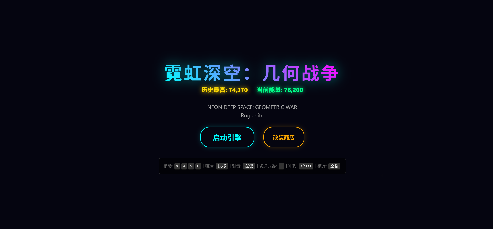
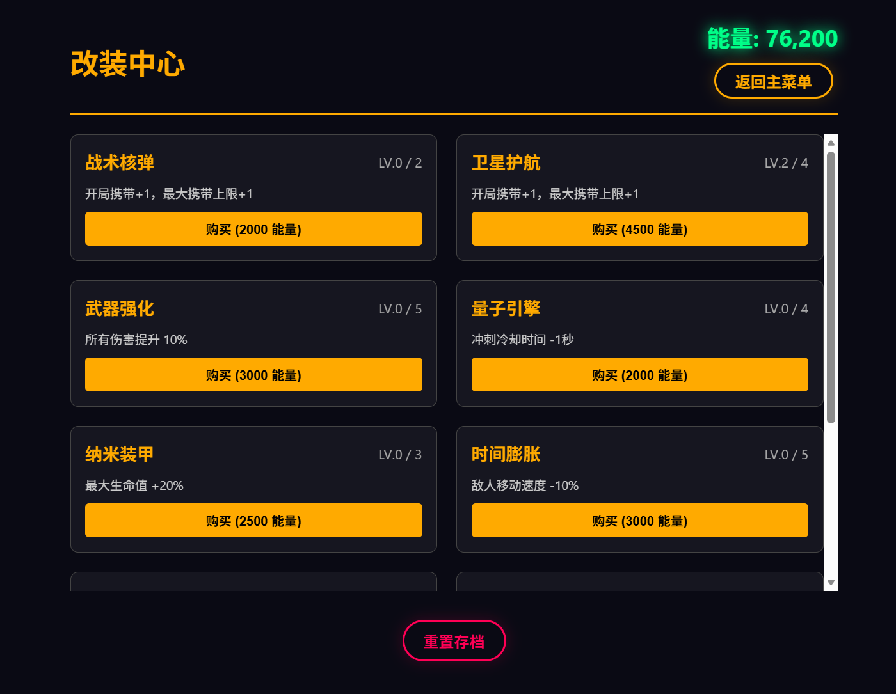
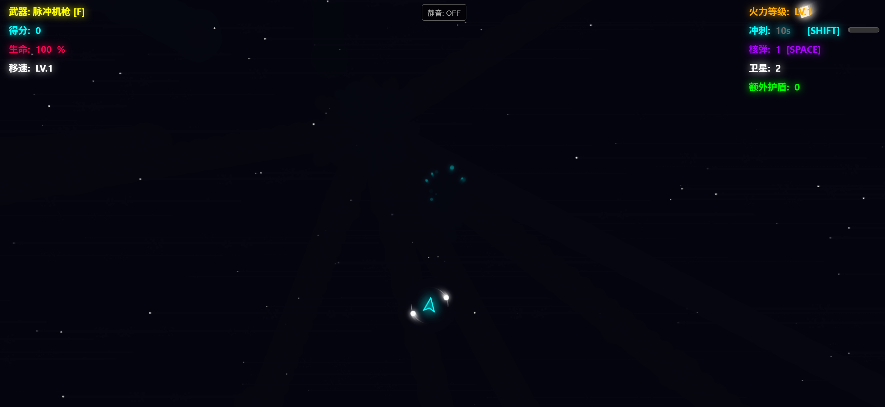

# 霓虹深空：几何战争 (Neon Deep Space: Geometric War)

  

A visually intense, browser-based Roguelite shooter built with vanilla JavaScript and HTML5 Canvas. Dive into the neon deep space, fight geometric enemies, upgrade your ship, and survive as long as you can.







## ✨ Features

- **Neon Visuals:** Stunning glow effects, particles, and smooth animations.
- **Roguelite Elements:** Persistent progression using local storage to save your "Energy" and upgrades.
- **Weapon System:** Switch between three unique weapons (Blaster, Shotgun, Sniper) with upgradeable stats.
- **Skill System:** Dash to dodge, Bombs for crowd control, and Satellites for automatic defense.
- **Upgrade Shop:** Spend earned energy to permanently improve damage, health, speed, and more.
- **Procedural Enemies:** Fight a variety of geometric shapes, from fast Triangles to tough Circles and massive Bosses.
- **No External Dependencies:** Pure HTML/CSS/JS. No images or external libraries required.

## 🎮 How to Play

### Controls

| Action         | Key / Input      |
| -------------- | ---------------- |
| Move           | `W`, `A`, `S`, `D` |
| Aim            | `Mouse`          |
| Shoot          | `Left Click`     |
| Switch Weapon  | `F`              |
| Dash           | `Shift`          |
| Bomb (Nuke)    | `Space`          |

### Gameplay Tips

1. **Collect Energy:** Defeating enemies grants score and energy. Energy is used in the shop menu.
2. **Watch Your Health:** Pick up green `+` power-ups to restore HP.
3. **Manage Dash:** Use dash wisely to escape bullet hells or pass through enemies.
4. **Shop Strategy:** Invest in "Damage" and "Health" early to survive later waves.

## 🚀 Getting Started

No installation required! This game runs entirely in the browser.

1. Clone this repository:

    ```bash
    git clone https://github.com/your-username/neon-deep-space.git
    ```

2. Open `index.html` in your preferred web browser (Chrome, Firefox, Edge, etc.).
3. Click "启动引擎" (Start Engine) to begin.

## 🛠️ Tech Stack

- **HTML5 Canvas:** For high-performance 2D rendering.
- **CSS3:** For UI styling, HUD overlays, and glowing effects.
- **Vanilla JavaScript:** For game logic, physics, and audio synthesis (Web Audio API).

## 📝 Development Notes

- The game uses `localStorage` to save player progress (Energy, Upgrades, High Score).
- Audio is synthesized in real-time using the Web Audio API, meaning no external audio files are needed.

## 📄 License

This project is open source and available under the [MIT License](LICENSE).

---

**Enjoy the game! May your neon light shine bright in the deep space.**
